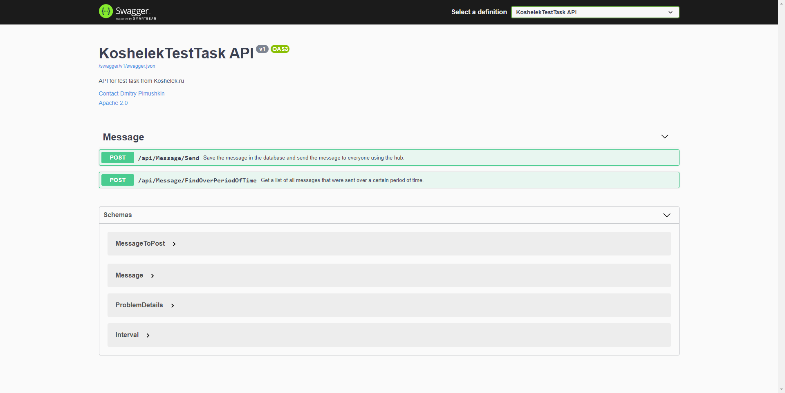
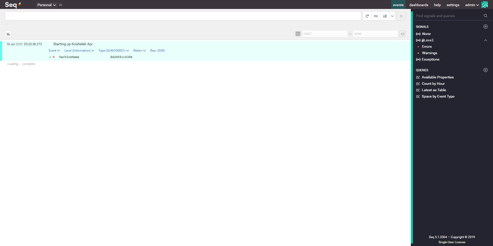

# Koshelek Test Task
## Table of contents
* [General info](#general-info)
* [API Documentation](#api-documentation)
* [Logging](#logging)
* [Technologies](#technologies)
* [Application launch](#application-launch)

## General info
This web application is a solution to the test task for the Junior C# Developer job. The client can send messages, view messages in real time using the web socket, 
and view messages sent by users in the last 10 minutes. The client performs these actions using the REST API and a web socket that is open on the API server side. 
The PostgreSQL server is used for storing messages sent by the client. The  application is used for convenient storage and search of 
structural logs.

## API Documentation
The API server has a web page with documentation that is automatically generated using the Swagger framework for the RESTful API specification. This web page is 
available by default at `http://localhost:8080/swagger/index.html`

## Logging
Logging is performed inside the Web API using the Serilog library and the [Seq](https://datalust.co/seq) application, which is used for convenient storage and 
search of structural logs. This web page is available by default at `http://localhost:5341/#/events`

## Technologies
Project is created with:
* Serilog.AspNetCore: 3.2.0
* Serilog.Sinks.Seq: 4.0.0
* Swashbuckle.AspNetCore: 5.5.1
* Microsoft.AspNetCore.SignalR: 1.1.0
* Npgsql: 4.1.3.1

## Application launch
To launch the app, you need:
1.  Download and install [Docker](https://docs.docker.com/docker-for-windows/install/)
2.  Download the app repository and go to the main folder of the downloaded repository using Command Prompt or PowerShell
3.  Enter the command: `docker-compose up`